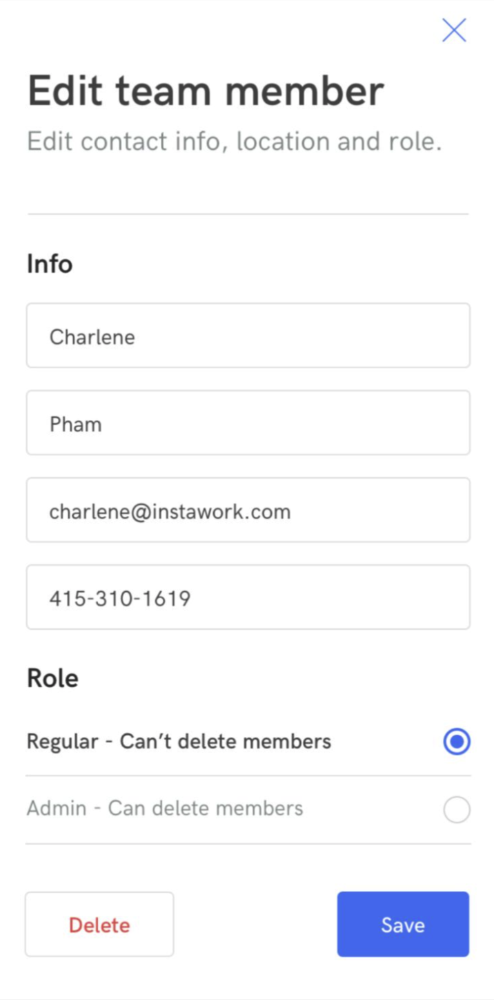

# Full-Stack Take-Home Assignment

## Project Overview

The project is to implement a simple **team-member management application** that allows the user view, edit, add, and delete team members. The app consists of 3 pages that are
documented below:

| List Page                            | Add Page                           | Edit Page                            |
| ------------------------------------ | ---------------------------------- | ------------------------------------ |
|  |  |  |

---

## Pages Description

### List Page

- Displays a list of all team members.
- The **subtitle** should reflect the correct number of team members.
- If a team member is an **admin**, it should be listed next to their name.
- Clicking a team member should navigate to the **Edit Page**.
- Clicking the "plus" (`+`) button should navigate to the **Add Page**.

### Add Page

- Appears when the user clicks the `+` button on the **List Page**.
- User inputs:
  - First Name
  - Last Name
  - Phone Number
  - Email
  - Role selection (defaults to **Regular**)
- Clicking **Save** should:
  - Add the team member to the list.
  - Redirect back to the **List Page**.

### Edit Page

- Appears when the user clicks on a team member from the **List Page**.
- Displays a form where the user can **edit details** of the team member.
- Allows changing the **role** of the team member.
- Clicking **Save** should:
  - Update the team member's details.
  - Redirect back to the **List Page**.
- Clicking **Delete** should:
  - Remove the team member from the list.
  - Redirect back to the **List Page**.

---

## Notes

- The web app is implemented using **Django** and the **Django Rest Framework (DRF)**
- The front-end is a **Single Page Application (SPA)** built with **React**.
- Backend documentation is provided in the `backend/README.md` file.
- Frontend documentation is provided in the `frontend/README.md` file.

---

## Expectations

- When submitting the project, please include an **estimate of the total time spent** on development.
- Time log:
  - **Day 1:**
    - Total time: 4 hours
    - Get up to speed with Django REST Framework reading documentation and working through tutorials.
    - Setup Django project.
    - Implement the backend API
  - **Day 2:**
    - Total time: 8 hours
    - Research a good starting set of technologies for frontend
    - Implement the frontend structure.
    - Spend some time looking into UI component frameworks
      - End up just using plain Tailwind CSS and React to make minimal necesary components
      - While UI refinement was not a priority, I did spend some time (maybe more than necessary) making sure the app was usable and looked decent.
    - Connect the frontend to the backend API.
    - Fix some bugs and refine frontend workflow
  - **Day 3:**
    - Total time: 4 hours
    - Fine tune the frontend with some error handling on forms and better navigation
    - Write documentation
    - Prepare for submission
